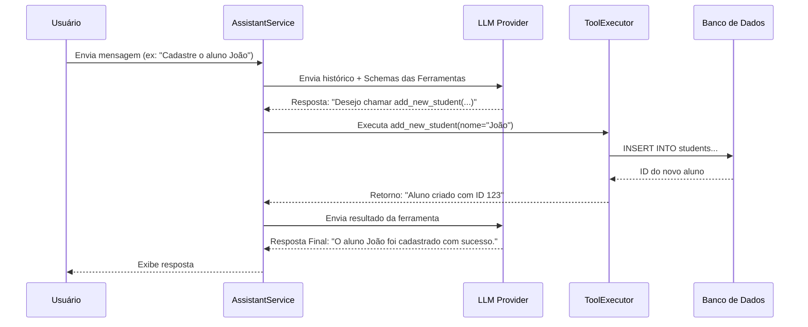

# Arquitetura do Sistema - Gestão Acadêmica

Este documento detalha a arquitetura técnica do software de Gestão Acadêmica. Ele serve como guia de referência para desenvolvedores que desejam manter, estender ou entender o funcionamento interno do sistema.

## 1. Visão Geral

O sistema é uma aplicação desktop desenvolvida em **Python 3.10+** que segue o padrão de arquitetura **MVC (Model-View-Controller)** adaptado, com uma camada de serviço robusta (**Service Layer**). A interface gráfica é construída com **CustomTkinter** (CTK), e a persistência de dados é gerenciada pelo **SQLAlchemy** (ORM) sobre um banco de dados **SQLite**.

Um componente central da arquitetura é o **Assistente de IA**, que opera de forma integrada mas desacoplada, utilizando um padrão de design de Ferramentas (Tools) para interagir com o sistema de forma segura.

### Principais Tecnologias
-   **Linguagem:** Python
-   **GUI:** CustomTkinter (Wrapper moderno sobre Tkinter)
-   **ORM:** SQLAlchemy
-   **Banco de Dados:** SQLite
-   **IA:** Integração agnóstica de provedor (OpenAI, Ollama, Maritaca, etc.)
-   **Gerenciamento de Dependências:** Poetry
-   **Testes:** Pytest

## 2. Estrutura de Diretórios

A organização do código reflete a separação de responsabilidades:

```text
.
├── app/
│   ├── core/               # Núcleo da aplicação (Configuração, Segurança, Framework de IA)
│   │   ├── llm/            # Abstração dos provedores de LLM (OpenAI, Ollama, etc.)
│   │   ├── security/       # Gerenciamento de credenciais
│   │   ├── tools/          # Framework de execução de ferramentas da IA (Registry, Executor)
│   │   └── config.py       # Gerenciamento de configurações persistentes
│   ├── data/               # Configuração da conexão com o banco de dados
│   ├── models/             # Modelos ORM (SQLAlchemy) - Definição do Schema
│   ├── services/           # Lógica de Negócios (DataService, AssistantService, ReportService)
│   ├── tools/              # Implementação concreta das ferramentas do Agente
│   ├── ui/                 # Camada de Apresentação (Views e MainApp)
│   │   ├── views/          # Telas individuais da aplicação
│   │   └── main_app.py     # Ponto de entrada da UI e Loop de Eventos
│   └── utils/              # Utilitários (Async, Gráficos, Parsers)
├── tests/                  # Testes Automatizados
├── AGENTS.md               # Diretrizes para Agentes de IA (Meta-documentação)
├── main.py                 # Ponto de entrada da aplicação (Bootstrap)
└── pyproject.toml          # Definição de dependências (Poetry)
```

## 3. Camada de Dados (Data Layer)

A camada de dados utiliza o **SQLAlchemy** para mapear classes Python para tabelas do banco de dados SQLite (`academic_management.db`).

### Inicialização
A inicialização do banco de dados ocorre em `main.py`. O sistema verifica a existência das tabelas e as cria automaticamente usando `Base.metadata.create_all(engine)` caso não existam. O uso do **Alembic foi removido** em favor dessa abordagem simplificada para este projeto.

### Diagrama ERD (Entidade-Relacionamento)

```mermaid
erDiagram
    STUDENT ||--o{ CLASS_ENROLLMENT : "possui"
    STUDENT ||--o{ GRADE : "recebe"
    STUDENT ||--o{ INCIDENT : "envolvido_em"
    CLASS ||--o{ CLASS_ENROLLMENT : "contém"
    CLASS ||--o{ CLASS_SUBJECT : "ensina"
    CLASS ||--o{ INCIDENT : "registra"
    COURSE ||--o{ CLASS_SUBJECT : "definido_em"
    CLASS_SUBJECT ||--o{ ASSESSMENT : "inclui"
    CLASS_SUBJECT ||--o{ LESSON : "rastreia"
    ASSESSMENT ||--o{ GRADE : "avaliado_por"

    STUDENT {
        int id
        string first_name
        string last_name
    }
    CLASS {
        int id
        string name
    }
    COURSE {
        int id
        string name
    }
    CLASS_ENROLLMENT {
        int id
        int student_id
        int class_id
        string status
    }
    GRADE {
        int id
        float score
    }
```

## 4. Camada de Serviços (Service Layer)

A lógica de negócios é encapsulada em serviços, promovendo a reutilização e testabilidade.

### `DataService` (`app/services/data_service.py`)
Atua como um **Data Access Object (DAO)** centralizado.
-   Responsável por todas as operações CRUD.
-   Gerencia transações de banco de dados (`Commit`/`Rollback`).
-   Injeta a sessão do banco de dados, permitindo fácil "mocking" em testes.
-   **Padrão Importante:** Retorna dicionários (DTOs) ou tipos primitivos para a UI, evitando problemas com objetos SQLAlchemy "detached" na interface.

### `AssistantService` (`app/services/assistant_service.py`)
Orquestra a inteligência artificial.
-   Mantém o histórico de conversas.
-   Gerencia o ciclo de vida do provedor de LLM.
-   Coordena a execução de ferramentas solicitadas pela IA.

### `ReportService` (`app/services/report_service.py`)
-   Centraliza a lógica de geração de relatórios, gráficos e exportações CSV.
-   Compartilhado entre a UI e o Agente de IA.

## 5. Arquitetura do Agente de IA

O sistema implementa um padrão robusto de "Function Calling" (Chamada de Função), permitindo que o LLM interaja com o banco de dados de forma determinística e segura.

### Componentes Principais (`app/core/`)

1.  **`LLMProvider` (Interface):** Classe base abstrata que define como comunicar com diferentes IAs (OpenAI, Ollama, etc.). Isso permite trocar o "cérebro" da aplicação sem alterar o código do assistente.
2.  **`ToolRegistry`:** Um registro central onde funções Python decoradas com `@tool` são armazenadas. Ele gera automaticamente os schemas JSON que são enviados para o LLM.
3.  **`ToolExecutor`:** Responsável por receber a solicitação do LLM (nome da ferramenta + argumentos JSON), validar, executar a função Python real e retornar o resultado.

### Fluxo de Execução



## 6. Camada de Interface (UI) e Assincronismo

A interface utiliza **CustomTkinter** e roda em um loop de eventos principal (Main Thread). No entanto, o sistema realiza muitas operações de I/O (Banco de Dados, Chamadas de API de IA) que são bloqueantes.

### Solução Híbrida (Tkinter + Asyncio)
Para manter a UI responsiva, o `MainApp` (`app/ui/main_app.py`) implementa um mecanismo de integração:

1.  **Loop Asyncio:** Um loop de eventos `asyncio` roda controlado pelo loop do Tkinter através de polling (`self.after(20, self.update_asyncio)`).
2.  **Fila de Comunicação (`Queue`):** As tarefas assíncronas (executadas em threads separadas ou no loop asyncio) comunicam resultados de volta para a thread da UI através de uma `queue.Queue`.
3.  **`run_async_task`:** Um utilitário em `app/utils/async_utils.py` facilita o despacho de corrotinas para o background e define callbacks para atualizar a UI quando terminarem.

## 7. Desenvolvimento e Testes

-   **Testes:** Rodam com `pytest`. O arquivo `tests/conftest.py` configura um banco de dados SQLite **em memória** para garantir que os testes sejam rápidos e isolados (não afetam o banco de dados de desenvolvimento).
-   **Injeção de Dependência:** As Views recebem instâncias de `DataService` e `AssistantService` no construtor, facilitando a substituição por Mocks durante os testes.
