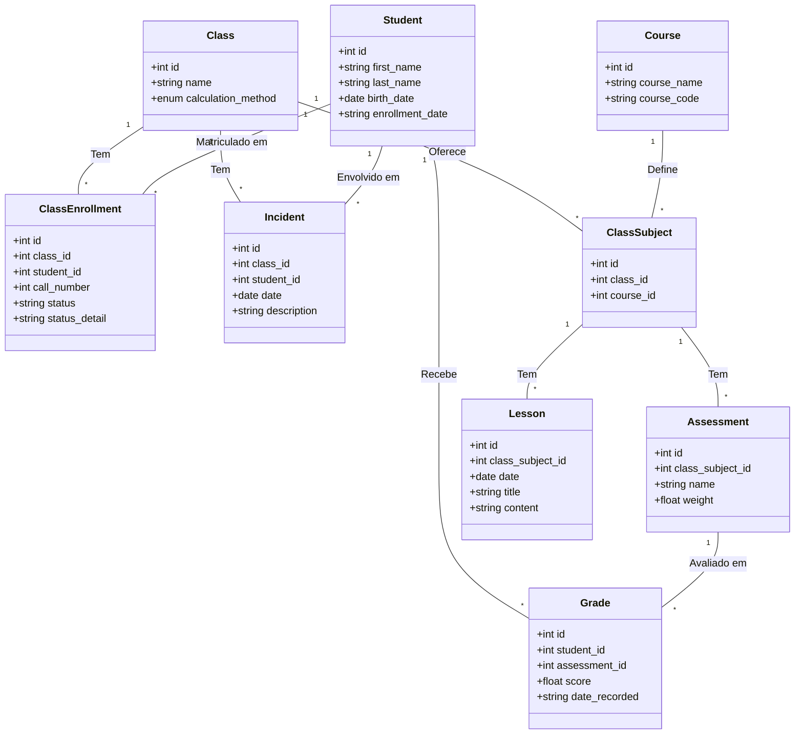
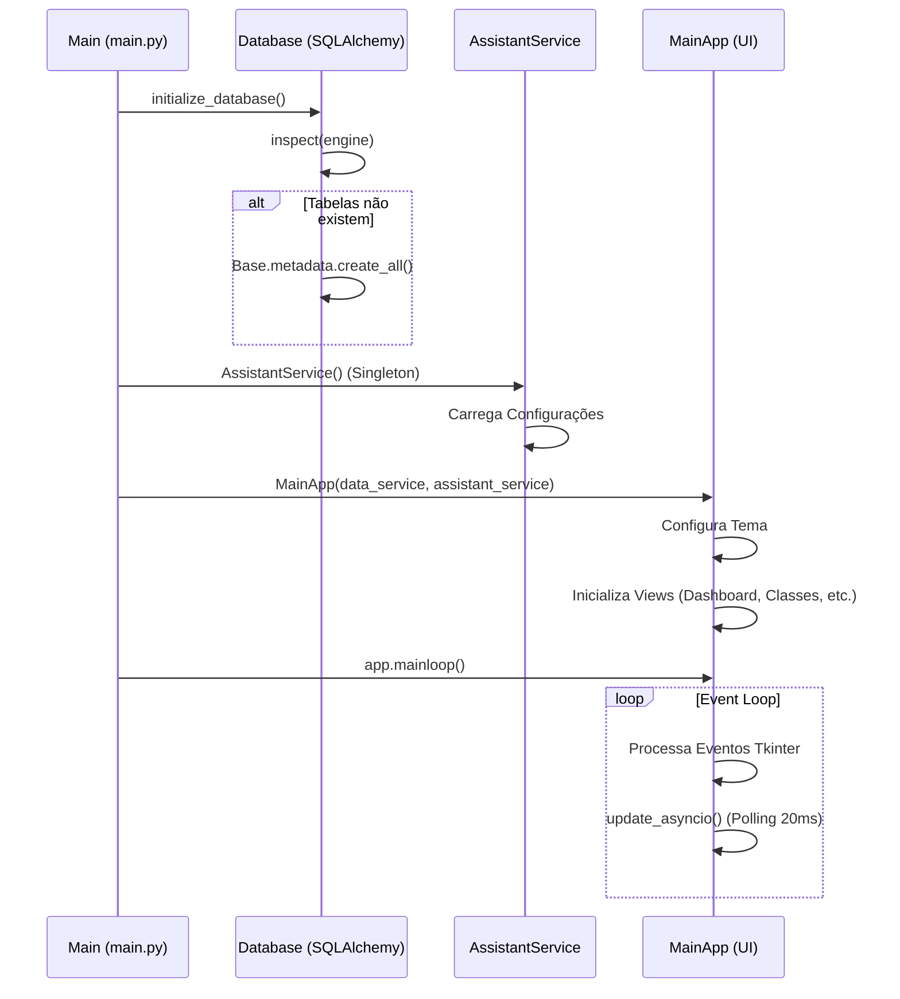
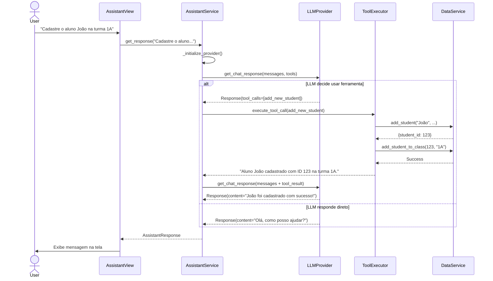

# Guia de Desenvolvimento e Arquitetura

Este documento fornece uma visão detalhada da arquitetura, design e fluxos de execução do Sistema de Gestão Acadêmica. Ele serve como referência para novos desenvolvedores entenderem como os componentes interagem e como o sistema é estruturado.

Para diretrizes específicas sobre desenvolvimento de agentes de IA, consulte [AGENTS.md](../AGENTS.md).
Para uma visão técnica de alto nível, consulte [ARCHITECTURE.md](../ARCHITECTURE.md).

---

## 1. Visão Geral (Diagrama de Casos de Uso)

O sistema atende a dois atores principais: o **Usuário** (Administrador/Professor) e o **Assistente de IA**. Abaixo estão as principais funcionalidades disponíveis.

```mermaid
usecaseDiagram
    actor "Usuário (Professor/Admin)" as User
    actor "Assistente de IA" as AI

    package "Sistema de Gestão Acadêmica" {
        usecase "Gerenciar Turmas" as UC1
        usecase "Gerenciar Alunos (Importar/Editar)" as UC2
        usecase "Gerenciar Notas e Avaliações" as UC3
        usecase "Gerenciar Aulas (Conteúdo)" as UC4
        usecase "Registrar Incidentes" as UC5
        usecase "Gerar Relatórios e Gráficos" as UC6
        usecase "Consultar Assistente Inteligente" as UC7
        usecase "Executar Ferramentas de Banco de Dados" as UC8
        usecase "Executar Ferramentas de Relatório" as UC9
    }

    User --> UC1
    User --> UC2
    User --> UC3
    User --> UC4
    User --> UC5
    User --> UC6
    User --> UC7

    UC7 ..> AI : Interage com
    AI --> UC8 : Executa Ações
    AI --> UC9 : Gera Análises
```

---

## 2. Modelo de Dados (Diagrama de Classes)

O banco de dados utiliza SQLite com SQLAlchemy ORM. O diagrama abaixo ilustra as entidades e seus relacionamentos.

**Nota:** Não existe uma entidade de "Presença" (Attendance). A gestão é feita através de `ClassEnrollment` (Status: Ativo/Inativo), `Lesson` (Registro de conteúdo de aula) e `Incident` (Ocorrências disciplinares).



---

## 3. Arquitetura de Componentes

O sistema segue uma arquitetura em camadas, separando a Interface de Usuário (UI), Lógica de Negócios (Services) e Acesso a Dados (Data Layer).

```mermaid
componentDiagram
    package "Camada de Apresentação (UI)" {
        [MainApp (CustomTkinter)] as UI_Main
        [Views (ClassDetail, Dashboard, etc.)] as UI_Views
    }

    package "Camada de Serviço (Business Logic)" {
        [DataService (Singleton)] as Service_Data
        [AssistantService (AI Orchestrator)] as Service_AI
        [ReportService (Charts/Files)] as Service_Report
    }

    package "Núcleo e Ferramentas" {
        [ToolRegistry] as Core_Tools
        [ToolExecutor] as Core_Executor
        [LLMProvider (OpenAI/Ollama)] as Core_LLM
    }

    package "Camada de Dados" {
        [SQLite Database] as DB
    }

    %% Conexões
    UI_Main --> UI_Views : Gerencia Navegação
    UI_Views --> Service_Data : CRUD Requests
    UI_Views --> Service_AI : Chat Requests
    UI_Views --> Service_Report : Relatórios Requests

    Service_Data --> DB : SQLAlchemy ORM
    Service_Report --> Service_Data : Fetch Data

    Service_AI --> Core_LLM : Envia Prompts
    Service_AI --> Core_Executor : Solicita Execução
    Core_Executor --> Core_Tools : Consulta
    Core_Executor --> Service_Data : Executa Ações de Banco
    Core_Executor --> Service_Report : Executa Ações de Relatório
```

---

## 4. Fluxos de Execução (Diagramas de Sequência)

### 4.1. Inicialização do Sistema
Este diagrama detalha o processo de startup da aplicação, desde o `main.py` até o loop de eventos da UI.



### 4.2. Interação com o Assistente de IA
Este fluxo mostra como uma solicitação do usuário é processada pelo Assistente, convertida em chamadas de ferramentas e retornada como resposta natural.


