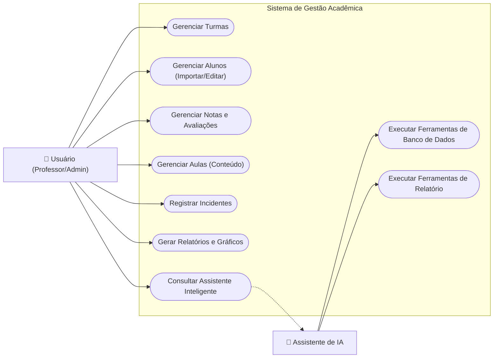
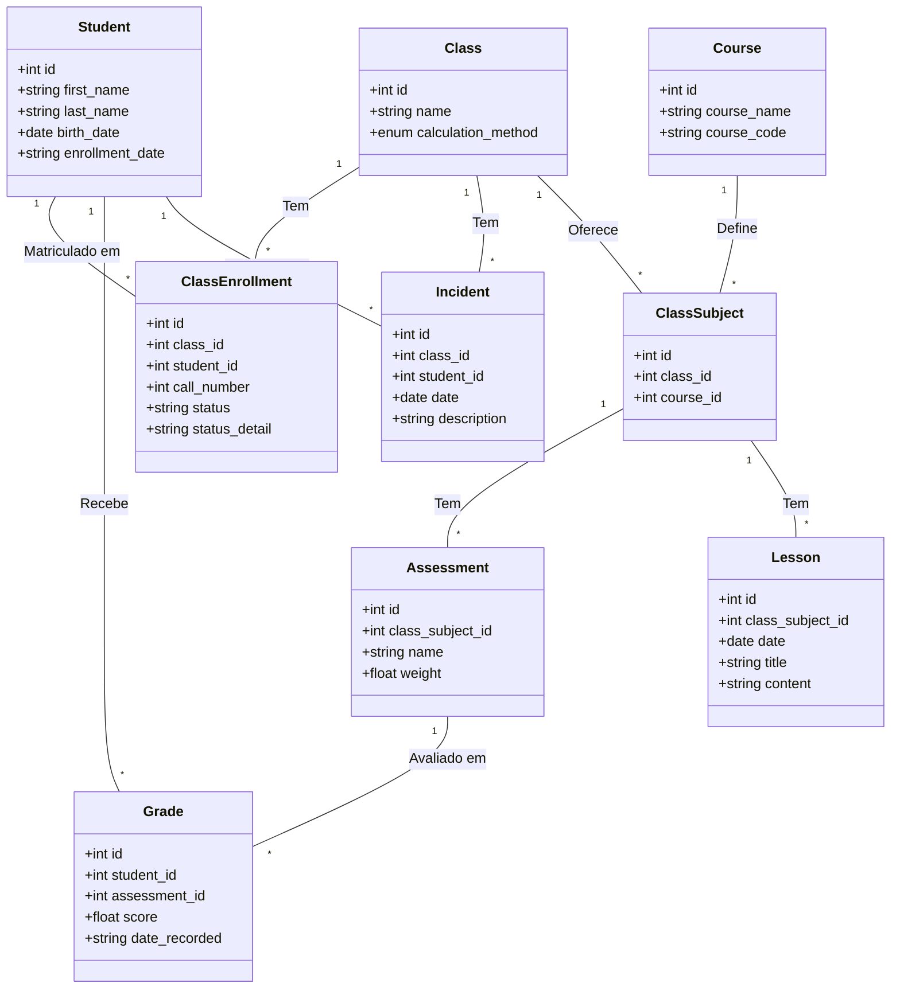
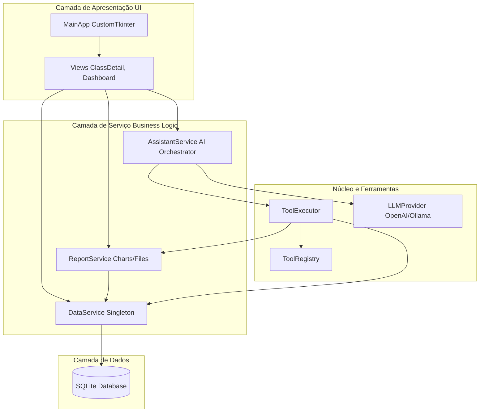
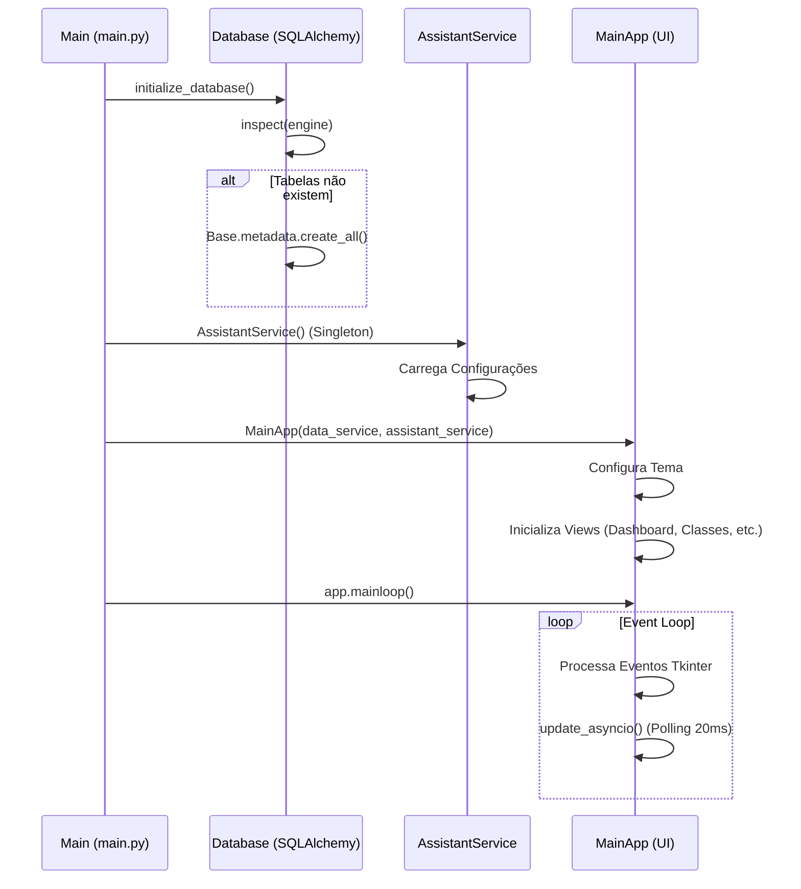
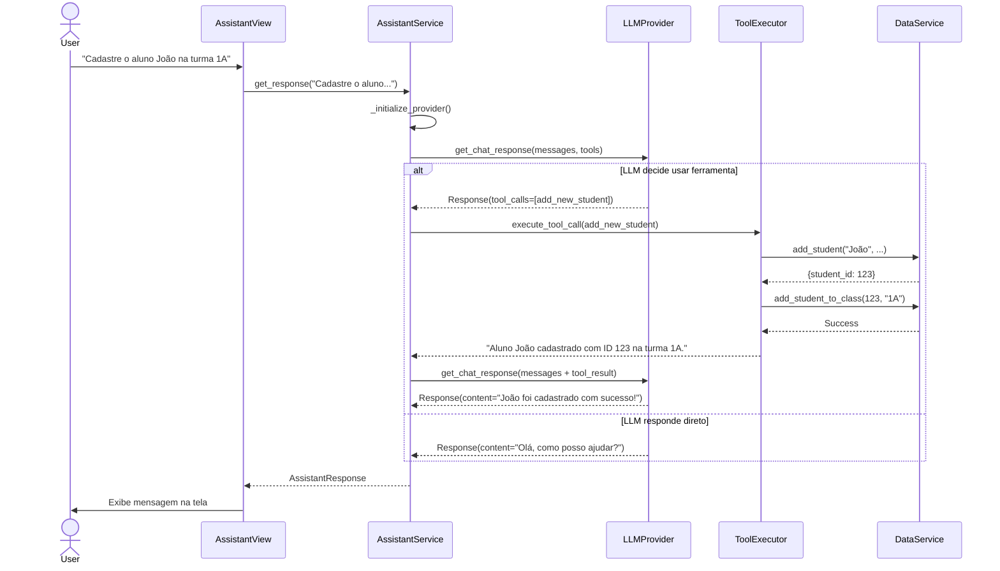

# Guia de Desenvolvimento e Arquitetura

Este documento fornece uma visão detalhada da arquitetura, design e fluxos de execução do Sistema de Gestão Acadêmica. Ele serve como referência para novos desenvolvedores entenderem como os componentes interagem e como o sistema é estruturado.

Para diretrizes específicas sobre desenvolvimento de agentes de IA, consulte [AGENTS.md](../AGENTS.md).
Para uma visão técnica de alto nível, consulte [ARCHITECTURE.md](../ARCHITECTURE.md).

---

## 1. Visão Geral (Diagrama de Casos de Uso)

O sistema atende a dois atores principais: o **Usuário** (Administrador/Professor) e o **Assistente de IA**. Abaixo estão as principais funcionalidades disponíveis, representadas através de um fluxograma de interação.

---

## 2. Modelo de Dados (Diagrama de Classes)

O banco de dados utiliza SQLite com SQLAlchemy ORM. O diagrama abaixo ilustra as entidades e seus relacionamentos.

**Nota:** Não existe uma entidade de "Presença" (Attendance). A gestão é feita através de `ClassEnrollment` (Status: Ativo/Inativo), `Lesson` (Registro de conteúdo de aula) e `Incident` (Ocorrências disciplinares).

---

## 3. Arquitetura de Componentes

O sistema segue uma arquitetura em camadas, separando a Interface de Usuário (UI), Lógica de Negócios (Services) e Acesso a Dados (Data Layer).

---

## 4. Fluxos de Execução (Diagramas de Sequência)

### 4.1. Inicialização do Sistema
Este diagrama detalha o processo de startup da aplicação, desde o `main.py` até o loop de eventos da UI.

### 4.2. Interação com o Assistente de IA
Este fluxo mostra como uma solicitação do usuário é processada pelo Assistente, convertida em chamadas de ferramentas e retornada como resposta natural.

