# Guia de Desenvolvimento e Arquitetura

Este documento fornece uma visão detalhada da arquitetura, design e fluxos de execução do Sistema de Gestão Acadêmica. Ele serve como referência para novos desenvolvedores entenderem como os componentes interagem e como o sistema é estruturado.

Para diretrizes específicas sobre desenvolvimento de agentes de IA, consulte [AGENTS.md](../AGENTS.md).
Para uma visão técnica de alto nível, consulte [ARCHITECTURE.md](../ARCHITECTURE.md).

---

## 1. Visão Geral (Diagrama de Casos de Uso)

O sistema atende a dois atores principais: o **Usuário** (Administrador/Professor) e o **Assistente de IA**. Abaixo estão as principais funcionalidades disponíveis, representadas através de um fluxograma de interação.

```mermaid
graph LR
    %% Definição dos Atores (Fora do Sistema)
    User["👤 Usuário (Professor/Admin)"]
    AI["🤖 Assistente de IA"]

    %% Limite do Sistema
    subgraph System ["Sistema de Gestão Acadêmica"]
        direction TB
        UC1(["Gerenciar Turmas"])
        UC2(["Gerenciar Alunos (Importar/Editar)"])
        UC3(["Gerenciar Notas e Avaliações"])
        UC4(["Gerenciar Aulas (Conteúdo)"])
        UC5(["Registrar Incidentes"])
        UC6(["Gerar Relatórios e Gráficos"])
        UC7(["Consultar Assistente Inteligente"])
        UC8(["Executar Ferramentas de Banco de Dados"])
        UC9(["Executar Ferramentas de Relatório"])
    end

    %% Conexões Usuário -> Casos de Uso
    User --> UC1
    User --> UC2
    User --> UC3
    User --> UC4
    User --> UC5
    User --> UC6
    User --> UC7

    %% Conexões Casos de Uso -> IA
    UC7 -.-> AI
    AI --> UC8
    AI --> UC9
```

---

## 2. Modelo de Dados (Diagrama de Classes)

O banco de dados utiliza SQLite com SQLAlchemy ORM. O diagrama abaixo ilustra as entidades e seus relacionamentos.

**Nota:** Não existe uma entidade de "Presença" (Attendance). A gestão é feita através de `ClassEnrollment` (Status: Ativo/Inativo), `Lesson` (Registro de conteúdo de aula) e `Incident` (Ocorrências disciplinares).

---

## 3. Arquitetura de Componentes

O sistema segue uma arquitetura em camadas, separando a Interface de Usuário (UI), Lógica de Negócios (Services) e Acesso a Dados (Data Layer).

---

## 4. Fluxos de Execução (Diagramas de Sequência)

### 4.1. Inicialização do Sistema
Este diagrama detalha o processo de startup da aplicação, desde o `main.py` até o loop de eventos da UI.

```mermaid
sequenceDiagram
    participant Boot as Main (main.py)
    participant DB as Database (SQLAlchemy)
    participant AS as AssistantService
    participant UI as MainApp (UI)

    Boot->>DB: initialize_database()
    DB->>DB: inspect(engine)
    alt Tabelas não existem
        DB->>DB: Base.metadata.create_all()
    end

    Boot->>AS: AssistantService() (Singleton)
    AS->>AS: Carrega Configurações

    Boot->>UI: MainApp(data_service, assistant_service)
    UI->>UI: Configura Tema
    UI->>UI: Inicializa Views (Dashboard, Classes, etc.)

    Boot->>UI: app.mainloop()
    loop Event Loop
        UI->>UI: Processa Eventos Tkinter
        UI->>UI: update_asyncio() (Polling 20ms)
    end
```

### 4.2. Interação com o Assistente de IA
Este fluxo mostra como uma solicitação do usuário é processada pelo Assistente, convertida em chamadas de ferramentas e retornada como resposta natural.

```mermaid
sequenceDiagram
    actor User
    participant View as AssistantView
    participant Service as AssistantService
    participant LLM as LLMProvider
    participant Exec as ToolExecutor
    participant Data as DataService

    User->>View: "Cadastre o aluno João na turma 1A"
    View->>Service: get_response("Cadastre o aluno...")

    Service->>Service: _initialize_provider()
    Service->>LLM: get_chat_response(messages, tools)

    alt LLM decide usar ferramenta
        LLM-->>Service: Response(tool_calls=[add_new_student])
        Service->>Exec: execute_tool_call(add_new_student)

        Exec->>Data: add_student("João", ...)
        Data-->>Exec: {student_id: 123}
        Exec->>Data: add_student_to_class(123, "1A")
        Data-->>Exec: Success

        Exec-->>Service: "Aluno João cadastrado com ID 123 na turma 1A."

        Service->>LLM: get_chat_response(messages + tool_result)
        LLM-->>Service: Response(content="João foi cadastrado com sucesso!")
    else LLM responde direto
        LLM-->>Service: Response(content="Olá, como posso ajudar?")
    end

    Service-->>View: AssistantResponse
    View->>User: Exibe mensagem na tela
```

